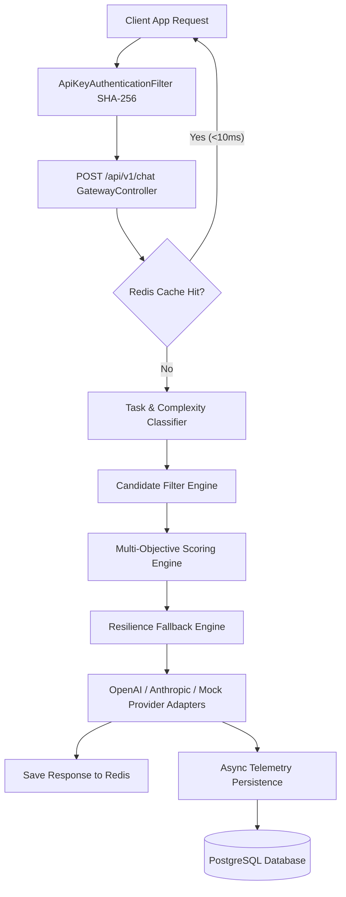

# ⚡ ModelRouter — Adaptive AI Inference Gateway & Control Plane


**ModelRouter** is a high-performance, resilient AI inference gateway and control plane built with **Java 21**, **Spring Boot 3**, **PostgreSQL**, **Redis**, and a **Next.js 14 + TypeScript** operational dashboard.

It sits between client applications and multiple AI providers (OpenAI, Anthropic, Gemini, DeepSeek, Mock), dynamically routing requests based on task category, token cost, latency, quality, and circuit breaker health policies.

---

## 🌟 Key Features

1. **Unified AI Gateway (`POST /api/v1/chat`)**: Single API endpoint replacing multi-provider client integration code.
2. **Task & Complexity Classifier**: Auto-detects prompt categories (`CODE`, `REASONING`, `WRITING`, `CHAT`) and token complexity.
3. **Multi-Objective Scoring Engine**: Dynamic candidate ranking across modes (`CHEAP`, `FAST`, `QUALITY`, `BALANCED`).
4. **Resilience & Fallback State Machine**: Automatic retry and failover execution on ranked runner-up providers during outages.
5. **Exact-Match Redis Response Cache**: SHA-256 prompt hashing (`cache:chat:<sha256>`) for instant `<10ms` response hits.
6. **Sliding-Window Rate Limiting**: Per-organization Requests-per-Minute (RPM) enforcement with HTTP 429 protection.
7. **Circuit Breaker Model Health Tracker**: Live tracking (`health:model:<id>`) auto-bypassing degraded providers.
8. **Next.js 14 Operational Dashboard**: Real-time KPI charts, live weight sliders, model inventory, and step-by-step decision trace inspector.

---

## 📐 System Architecture



---

## 🚀 Quick Start & Installation

### Option 1: Docker Compose (1-Click Deployment)
```bash
docker compose up -d
```
- **Backend API**: `http://localhost:8080`
- **Next.js Dashboard**: `http://localhost:3000`

### Option 2: Local Development Setup
```bash
# 1. Start Backend API
cd backend
mvn spring-boot:run

# 2. Start Next.js Dashboard
cd ../frontend
npm install
npm run dev
```

---

## 🧪 Testing Gateway Endpoints via cURL

### 1. Send Inference Prompt to Gateway
```bash
curl -X POST http://localhost:8080/api/v1/chat \
  -H "Content-Type: application/json" \
  -H "X-API-Key: modelrouter-demo-key-123" \
  -d '{
    "mode": "BALANCED",
    "messages": [
      {
        "role": "user",
        "content": "Write a Java function to sort an array using Quicksort."
      }
    ]
  }'
```

### 2. Fetch System Overview Analytics KPIs
```bash
curl http://localhost:8080/api/v1/admin/analytics/overview
```

---

## 📄 License
Licensed under the [MIT License](LICENSE).
