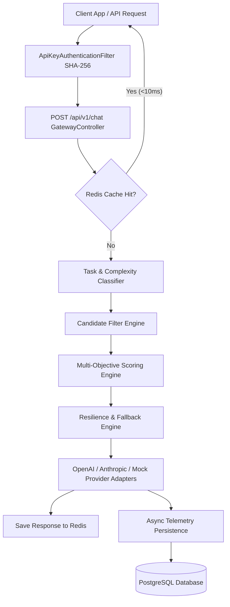
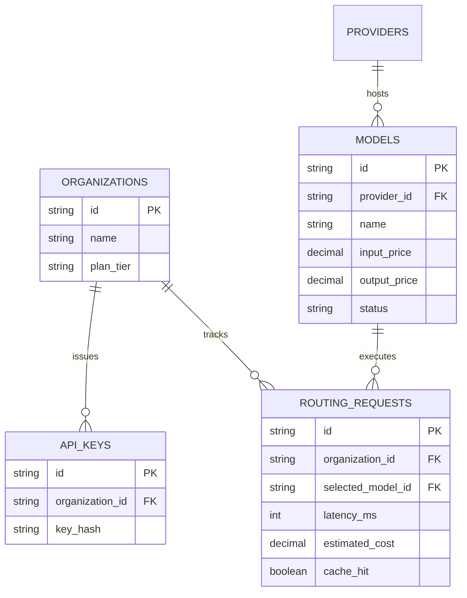

# 📐 ModelRouter System Architecture Blueprint

## High-Level Component Flow

## Multi-Objective Scoring Equation

$$Score = (w_{quality} \cdot Q) + (w_{latency} \cdot L) + (w_{cost} \cdot C) + (w_{reliability} \cdot R) + (w_{capability} \cdot Cap)$$

## Entity Relationship Diagram (ERD)

